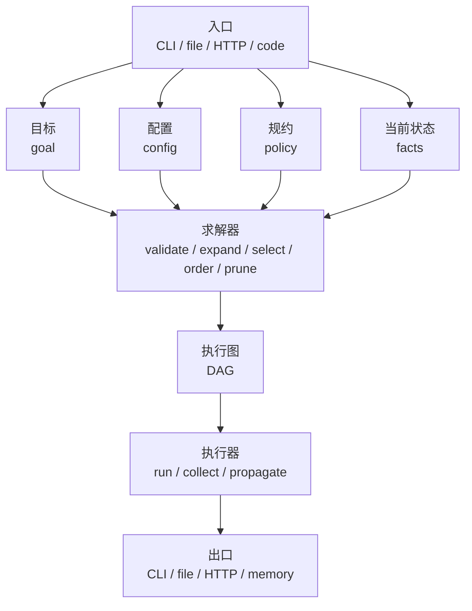

# 自动化基座

## 1. 先说结论

Clover 的自动化基座不是 task runner。它是一套按配置、规约和当前状态求解执行图的系统。

顺序固定是：

`目标 + 配置 + 规约 + 当前状态 -> 求解 -> DAG -> 执行 -> 出口`

这里有两个关键判断：

- DAG 是解，不是输入
- CLI、文件、HTTP 都只是入口或出口，不是内核

所以自动化基座要分三层：

- 求解内核
- 执行内核
- 入口 / 出口适配器

这层属于全景图里的“自动化基座”。它不是 `@clover.js/cli` 的一部分，也不是 `@clover.js/http` 的一部分。

## 2. 结构图

### 2.1 ASCII 图

```text
ingress
  -> goal
  -> config
  -> policy
  -> facts
        |
        v
     solver
  - validate
  - expand
  - select
  - order
  - prune
        |
        v
   execution plan
      (DAG)
        |
        v
    executor
  - run nodes
  - collect results
  - propagate failures
        |
        v
egress
  - cli
  - file
  - http
  - memory
```

### 2.2 Mermaid 图



## 3. 这层到底做什么

自动化基座只做工程任务编排，不直接承载业务逻辑。

它负责：

- 接受一个目标
- 读取当前配置和规约
- 根据当前状态求出一张可执行图
- 执行这张图
- 把结果交给出口层

它不负责：

- 页面渲染
- HTTP 请求解析
- 终端参数解析
- 业务规则本身

这些能力都应该继续留在各自的宿主边界层。

## 4. 七个组成部分

### 4.1 目标

目标只回答一件事：这次想得到什么。

第一阶段的目标类型应该尽量少，例如：

- `build-package`
- `test-package`
- `lint-workspace`
- `release-check`

目标不是命令行字符串，也不是脚本名。目标要是固定 shape 的数据。

### 4.2 配置

配置只回答：这个项目现在长什么样。

例如：

- workspace 包列表
- 包依赖关系
- 每类任务的基础配置
- 输出目录
- 可用工具
- 并发上限

配置不写执行步骤。它只描述环境和能力边界。

### 4.3 规约

规约只回答：什么是合法解。

例如：

- 哪些依赖必须先完成
- 哪些节点不能并行
- 哪些目标必须包含哪些子目标
- 哪些节点失败后必须中止

规约不是“推荐顺序”。规约是硬约束。

### 4.4 当前状态

当前状态只回答：现在已经知道什么。

例如：

- 某个包是否已构建
- 某个产物是否已存在
- 某个入口从哪里触发
- 某个节点是否已失败

这层是求解器剪枝和补边的输入，不是业务状态容器。

### 4.5 求解器

求解器是自动化基座的核心。

它不跑命令。它先求解。

它至少要做这几步：

1. 校验目标是否合法
2. 根据目标展开候选节点
3. 根据规约补依赖边
4. 根据当前状态裁掉不需要的节点
5. 检查是否有环
6. 输出可执行 DAG

所以真正的顺序不是“先写 DAG 再执行”，而是“先求解，再得到 DAG”。

### 4.6 执行器

执行器只负责跑求出来的图。

它至少要做：

- 拓扑执行
- 有限并发
- 失败传播
- 结果聚合
- 日志事件输出

执行器不应该自己决定补哪些节点，也不应该偷偷重写依赖关系。

### 4.7 入口和出口

入口和出口都只是适配层。

入口可以是：

- CLI
- 文件变化
- HTTP 请求
- 代码调用

出口可以是：

- stdout / stderr
- 文件
- HTTP response
- 内存结果

这两层都不该反向污染求解器和执行器。

## 5. 核心数据形状

第一版不要做 DSL。直接用固定 shape 的 TypeScript 对象。

建议至少有这些模型：

```ts
type Goal =
  | { kind: "build-package"; packageName: string }
  | { kind: "test-package"; packageName: string }
  | { kind: "lint-workspace" }
  | { kind: "release-check" };

type PlanNode = {
  id: string;
  kind: string;
  inputs: Readonly<Record<string, unknown>>;
};

type PlanEdge = {
  from: string;
  to: string;
};

type ExecutionPlan = {
  goal: Goal;
  nodes: readonly PlanNode[];
  edges: readonly PlanEdge[];
  targets: readonly string[];
};
```

执行结果也要固定 shape，不要让节点自己随便返回一堆半结构化对象。

## 6. 节点契约

每个节点都应该像 Clover 其他层一样，固定 shape、少魔法。

第一版节点至少要有：

- `id`
- `kind`
- `inputs`
- `run(...)`

节点不是匿名脚本片段，也不是临时 shell 字符串集合。

节点的职责是：

- 接收固定 shape 输入
- 运行一个受控动作
- 返回固定 shape 结果

## 7. 和 DAG 的关系

自动化基座的执行内核应该是 DAG 驱动。

但 DAG 不是用户直接手写的输入。DAG 是求解器的输出。

所以正确顺序是：

- 用户给目标
- 系统读取配置、规约和当前状态
- 求解器产出 DAG
- 执行器执行 DAG

这比把所有流程都手写成脚本顺序更符合 Clover 的风格。

因为 Clover 的整体路线本来就是：

- 先定协议和规约
- 再让实现服从规约

## 8. 第一版该做什么

第一版只做最小可用内核。

应该做：

- 目标模型
- 配置模型
- 规约模型
- 求解输出的 DAG 模型
- 最小求解器
- 最小执行器
- CLI 入口
- stdout / stderr / file / memory 出口

不该做：

- 通用工作流平台
- 动态 DSL
- 远程执行
- 缓存系统
- 增量求解
- HTTP 入口
- 任意副作用节点

## 9. 包层次建议

这层建议单独成为一个新包。

建议分成三个内部模块：

- `solver`
- `executor`
- `adapter`

入口层再建立在它上面，例如未来的：

- repo command
- 其他项目 CLI

不要把它直接塞进 `@clover.js/cli`。

## 10. 和全景图的关系

这份文档对应全景图里的“自动化基座”。

它和 `@clover.js/cli`、`@clover.js/http` 的关系是：

- `cli` 负责终端宿主边界
- `http` 负责请求响应边界
- 自动化基座负责求解和执行工程任务

这三者是并列关系，不是包含关系。
