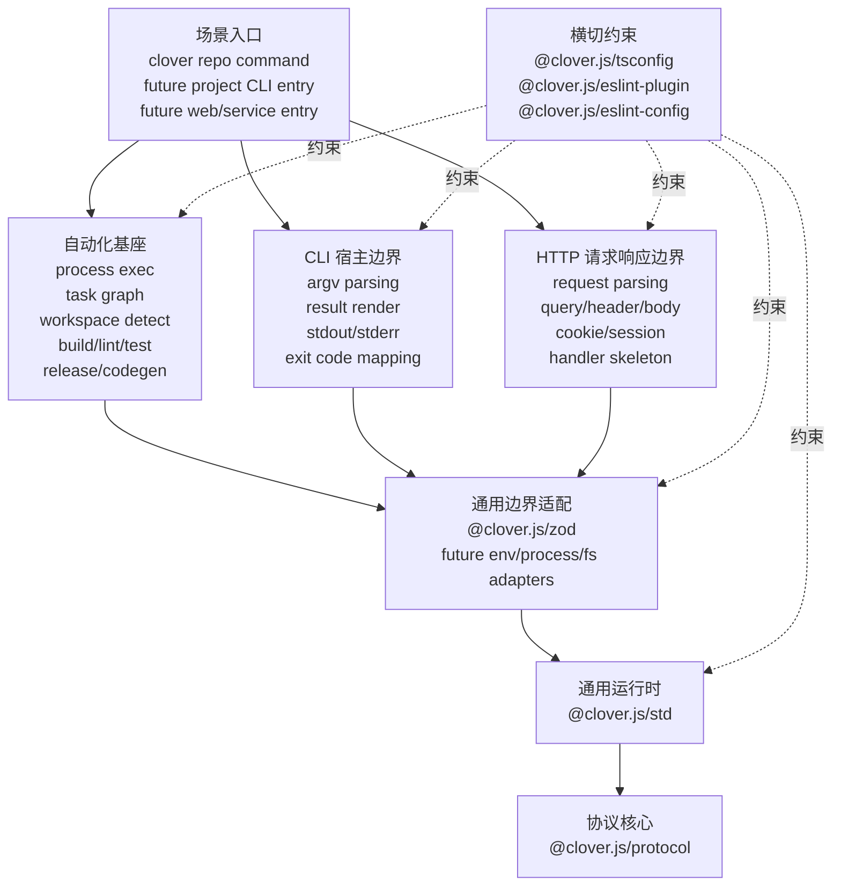

# 系统全景图

## 1. 先说结论

Clover 不是单个 SDK 包，也不是一套 lint 规则。它是一套面向多宿主逻辑层的 TypeScript 系统。

这套系统有四块主干：

- 核心能力栈：`@clover.js/protocol` -> `@clover.js/std` -> 通用边界适配
- 宿主边界线：CLI 宿主边界、HTTP 请求响应边界
- 支撑线：约束治理、自动化基座
- 场景入口：把前面这些能力装成可直接使用的命令或服务入口

这里说的 Web，不是页面和渲染层。这里主要通过 HTTP 请求响应边界来承接 Web 宿主里的逻辑层：

- request / response 的输入输出收敛
- query / headers / cookies / body 解析
- session / auth context / env 注入
- handler / middleware / action 的逻辑骨架
- Web 错误到 Clover 协议的转换

短期内，仓库工作流还会继续使用 Python。长期方向不是一直保留 Python，而是把自动化基座逐步收进 `@clover.js` 体系。

## 2. 结构图

### 2.1 ASCII 图

```text
                          @clover.js 系统全景图

┌──────────────────────────────────────────────────────────────────────┐
│ 场景入口                                                            │
│ - clover repo command                                               │
│ - future project CLI entry                                          │
│ - future web/service entry                                          │
└──────────────────────────────────────────────────────────────────────┘
                   │                       │                       │
                   v                       v                       v
┌──────────────────────┐  ┌──────────────────────┐  ┌──────────────────────┐
│ 自动化基座           │  │ CLI 宿主边界         │  │ HTTP 请求响应边界    │
│ - process exec       │  │ - argv parsing       │  │ - request parsing    │
│ - task graph         │  │ - result render      │  │ - query/header/body  │
│ - workspace detect   │  │ - stdout/stderr      │  │ - cookie/session     │
│ - build/lint/test    │  │ - exit code mapping  │  │ - handler skeleton   │
│ - release/codegen    │  │ - zod bridge         │  │ - http error mapping │
└──────────────────────┘  └──────────────────────┘  └──────────────────────┘
                   \               |                         /
                    \              |                        /
                     v             v                       v
              ┌──────────────────────────────────────────────┐
              │ 通用边界适配                                 │
              │ - @clover.js/zod                            │
              │ - future env/process/fs adapters            │
              └──────────────────────────────────────────────┘
                                   │
                                   v
              ┌──────────────────────────────────────────────┐
              │ 通用运行时                                   │
              │ - @clover.js/std                            │
              │ - string/number/object/path/url/async       │
              └──────────────────────────────────────────────┘
                                   │
                                   v
              ┌──────────────────────────────────────────────┐
              │ 协议核心                                     │
              │ - @clover.js/protocol                       │
              │ - None / Option / Result / CloverError      │
              └──────────────────────────────────────────────┘

横切约束：
- @clover.js/tsconfig
- @clover.js/eslint-plugin
- @clover.js/eslint-config
```

### 2.2 Mermaid 图



## 3. 每一块放什么

### 3.1 协议核心

这一层只放最小公共语义。

当前包：

- `@clover.js/protocol`

应该承载：

- `None`
- `Option<T>`
- `Result<T, Code, Payload>`
- `CloverError`
- 品牌类型
- 少量守卫和断言

不应该承载：

- Zod
- CLI 宿主 API
- HTTP 宿主 API
- 构建、测试、发布脚本

### 3.2 通用运行时

这一层放和宿主无关的通用能力。

当前包：

- `@clover.js/std`

应该承载：

- 字符串、数字、对象、路径、URL、异步流
- `Result` 组合
- 守卫和安全转换

这一层可以依赖协议核心，但不应该把宿主世界的杂质带进来。

### 3.3 通用边界适配

这一层负责把混乱的宿主输入先收敛成 Clover 协议。

当前包：

- `@clover.js/zod`

未来可以继续长的方向：

- env 适配
- process 适配
- fs 适配

这一层是多个宿主边界都能复用的公共入口。它不负责最终的 CLI 交互，也不负责最终的 Web handler 组织。

### 3.4 宿主边界

这一层按宿主拆开。

当前已经有：

- `@clover.js/cli`
- `@clover.js/http`

这两条线是并列关系，不是包含关系。

CLI 线负责：

- argv
- stdout / stderr
- exit code
- 业务结果到终端输出

HTTP 线负责：

- request / response
- query / headers / cookies / body
- session / auth context
- handler / middleware / action 的逻辑骨架

### 3.5 约束治理

这一层不提供业务能力。它负责把设计主张变成默认规则。

当前包：

- `@clover.js/tsconfig`
- `@clover.js/eslint-plugin`
- `@clover.js/eslint-config`

它是横切约束，不是业务依赖链上的一环。

### 3.6 自动化基座

这一层负责工程任务，不负责业务输入输出。

长期应该承载：

- 子进程执行
- 任务定义
- 任务依赖图
- workspace 发现
- build / lint / test / bench / release-check 编排
- 代码生成
- 清理和诊断

当前状态：

- 这部分能力主要还在 `scripts/` 目录
- 当前实现主要使用 Python

这代表当前实现，不代表长期终态。

### 3.7 场景入口

这一层只负责装配，不负责沉到底层协议里。

它的职责是把自动化基座、宿主边界和通用能力装成可直接调用的入口，例如：

- Clover 仓库自己的 `clover` 命令
- 未来给其他项目使用的 CLI 入口
- 未来 Web 服务的逻辑入口

## 4. 依赖纪律

这套系统的依赖方向必须固定。

- 协议核心不依赖上层
- 通用运行时只建立在协议核心上
- 通用边界适配建立在协议与运行时上
- CLI 和 HTTP 宿主边界建立在协议、运行时和通用边界适配上
- 自动化基座可以依赖底层通用能力，但不能把 repo 细节反向压进核心层
- 场景入口只做装配，不把自己变成新的核心层
- 约束治理是横切规则，不承载业务逻辑

最需要防住的两件事：

- 不要把宿主边界能力塞回 `std` 或 `protocol`
- 不要把仓库维护能力直接塞进 `@clover.js/cli`

## 5. 当前状态和后续方向

当前已经落地的部分：

- `@clover.js/protocol`
- `@clover.js/std`
- `@clover.js/zod`
- `@clover.js/cli`
- `@clover.js/http`
- `@clover.js/tsconfig`
- `@clover.js/eslint-plugin`
- `@clover.js/eslint-config`
- `scripts/` 里的 Python 工作流

当前还没有独立长出来的部分：

- `@clover.js` 体系内的自动化基座
- 统一的场景入口命令

短期判断：

- 现有 Python 工作流继续使用
- 文档先把长期方向写清楚
- 自动化基座后续逐步迁进 `@clover.js`

长期判断：

- `@clover.js` 不只是一组运行时包
- 它会同时覆盖协议、运行时、宿主逻辑边界、约束治理和自动化基座
- 但它仍然不应该变成没有边界的大杂烩
